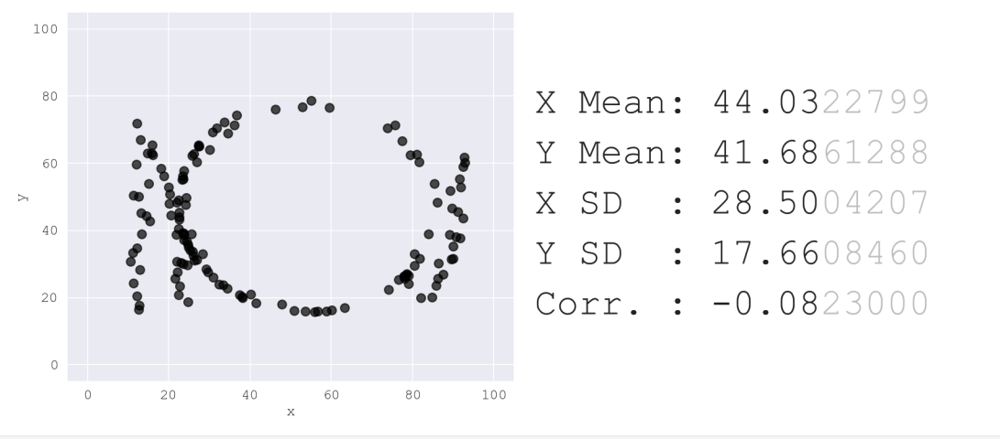

# Task 1

## Same Stats, Different Graphs---Datasaurus

### 专业：信息安全 	学号：2111408	姓名：周钰宸

### 论文复现

*让Datasaurus数据集经过默认次数的扰动，变化为其他形状（比如说circle）*

1. **搭建实验环境**

   使用Pycharm作为IDE进行实验，解决好所需的数据包和对应的依赖

   

   

2. **复现过程：**

   首先使用最基本的命令进行尝试，即使用dinosaur(dino)作为初始形状，**circle作为目标形状，扰动次数选择200000次迭代扰动，保留2位小数的统计学精度，均匀取其中150张图片保存下来。 **

   ```shell
   python same_stats.py run dino circle 200000 2 150
   ```

   

3. **复现结果：查看results文件夹。**

   可以看到生成了149个记录circle个data的csv文件，和145个中间过程图像。

   

   以下四个图形是分别间隔50个图像选取的，可以发现最开始的小恐龙嘴巴逐渐圆润，~~小手手也没了呜呜~~。第二张图还能看到它的丹鹤顶。**因此可以得到初步的观察结论：**

   * 变化过程中主要改变集中在前期，前25%次扰动已经能产生明显的定向变化
   * 变化过程后期几乎微动很小，大部分都在进行微调。**推测是因为许多点已经找到了局部最优解甚至是全局最优解，模拟退火算法再进行扰动很难或者不会再产生新解。**
   * 我们可以注意到最后生成的"圆形"，偏横向的椭圆而不是标准的圆形。并且明显更多的点倾向于分布在上下两侧而不是左右两侧。**这很可能是由于初始的数据中可以很明显地发现小恐龙的纵向尤其是偏中间的数据点分布远大于横向数据点分布。也就是初始的数据分布不均衡导致的。这也是潜在的改进方向之一。**

   


**==不过总体来说，实验较为成功。==**

### 任意形状探索

*使用网址http://robertgrantstats.co.uk/drawmydata.htm生成任意形状的点阵数据集，让他经过有限次扰动，变为其他形状*

#### 修改代码

首先第一步为了后续将不同的数据和图片集能够**储存在不同的位置**，**对程序中命令行添加参数**，具体做法为修改以下几部分：

1. **doc注释：**

   ```python
   """
   Usage:
       same_stats.py run <shape_start> <shape_end> [<save_path>][<iters>][<decimals>][<frames>]
       # ...blablabla...
   """
   ```

2. **main函数添加命令行参数：**

   ```python
   # run <shape_start> <shape_end> [<save_path>][<iters>][<decimals>] 运行命令行
   if __name__ == '__main__':
       arguments = docopt(__doc__, version='Same Stats 1.0')
       if arguments['run']:
           save_path = None
           it = 100000
           de = 2
           frames = 100
           if arguments['<save_path>']:
               save_path = arguments['<save_path>']
           if arguments['<iters>']:
               it = int(arguments['<iters>'])
           if arguments['<decimals>']:
               de = int(arguments['<decimals>'])
           if arguments['<decimals>']:
               frames = int(arguments['<frames>'])
   
           shape_start = arguments['<shape_start>']
           shape_end = arguments['<shape_end>']
   
           if shape_start in initial_datasets and shape_end in all_targets:
               do_single_run(shape_start, shape_end, save_path=save_path, iterations=it, decimals=de, num_frames=frames)
           else:
               print("************* One of those shapes isn't correct:")
               print("shape_start must be one of ", initial_datasets)
               print("shape_end must be one of ", all_targets)
   ```

3. **修改路径：**

   之后依次修改do_single_run，run_pattern，最后在核心的趋近于指定形状的函数中，添加路径部分：

   ```python
   # save this chart to the file 将此图表保存到文件中
           for x in range(write_frames.count(i)):
               if sv_path is not None:
                   directory = "results/" + sv_path + "/"
                   if not os.path.exists(directory):
                       os.makedirs(directory)
                   save_scatter_and_results(r_good,
                                            "results/" + sv_path + "/" + target + "-image-" + format(int(frame_count),
                                                                                                     '05'), 150,
                                            labels=labels)
                   r_good.to_csv("results/" + sv_path + "/" + target + "-data-" + format(int(frame_count), '05') + ".csv")
               else:
                   save_scatter_and_results(r_good, "results/" + target + "-image-" + format(int(frame_count), '05'), 150,
                                            labels=labels)
                   r_good.to_csv("results/" + target + "-data-" + format(int(frame_count), '05') + ".csv")
               # save_scatter(r_good, target + "-image-"+format(int(frame_count), '05'), 150)
   
   
               frame_count = frame_count + 1
       return r_good
   ```

#### 使用给定网址

1. **生成数据：**使用上述网址生成如下图所示的名为**NKU**的数据点分布（hhh）。保存至csv后放到seed_datasets目录下。这里有个小坑也是，数据集列名是X和Y，但是程序里面只能识别x和y。


2. **程序运行：添加新路径NKU后，再次运行，选择参数还是200000次迭代。**


3. **复现结果：**

   相比于小恐龙，这次又出现了新的变化规律：

   * 最重要的是经过相同的迭代轮数200000，其最后有**相当多数量的离群点，尽管大部分点能够一定程度上勾勒出圆形的轮廓，但是目标形状完美程序明显不如恐龙。推测原因是点的分布更加不均匀，尤其是字母N和字母U在两侧聚集了大量的数据。使得分布不均衡。**
   * **局部最优解陷阱更为明显：**模拟退火算法在搜索空间中随机游走，因此有时会陷入局部最优解，而无法跳出。这可能导致算法在全局最优解附近徘徊，而无法真正收敛。可以注意到同样也是最开始的25%数据点变化较大，后面那些离群点都没有很好地收敛，而是原地徘徊。**这便是陷入了局部最优解陷阱，很难真正收敛。**
   * **时间性能较差：**同样是140左右的数据，程序运行速度远低于小恐龙。





### 程序评价与探索

*简单评价一下程序的性能，即扰动次数和目标形状完美程度的关系(尝试用可视化图分析哦)*

#### 性能评价

为了能够更好地评价模型的性能，这里以之前我使用的**NKU数据集作为shape_start，circle作为shape_end，iterations即purturbations迭代次数从0开始，间隔为50000控制变量分别进行实验。**对于目标形状完美程度的衡量，我们采用以下指标：

**Fréchet距离**和**Hausdorff距离**都是衡量两个形状之间相似度的方法。以下是这两种方法的简介以及如何在Python中实现它们：

1. **Fréchet距离**：Fréchet距离是一种衡量两个曲线相似性的度量，它考虑了曲线上点的位置和顺序。可以使用`frechetdist`库来计算离散的Fréchet距离。

   

2. **Hausdorff距离**：Hausdorff距离是一种用来衡量两个点集之间的距离的度量，它考虑了点集中所有点的位置。在Python中，你可以使用`scipy`库中的`directed_hausdorff`函数来计算Hausdorff距离。    

   

#### 评价函数

为了更好地评价模型的性能，**我额外在utils文件夹中写了一个评价脚本evaluation.py**，来更方便地一键式对程序进行模型评价。

程序仿照same_stats.py**采用命令行的模型评价方式来运行。**主体分为以下函数

1. **get_points_on_circle**

   ```python
   def get_points_on_circle(cx, cy, r, num_points):
       """
       This function will generate points on a circle based on the hard-coded center and radius in the paper.
       :param cx: center x of the circle
       :param cy: center y of the circle
       :param r: radius of the circle
       :param num_points: points of circle to be generated and sampled, it should be identical to the number of the
       approximated trajectory to guarantee a same dimension for distance calculation.
       :return:
       """
       circle_points = []
       for i in range(num_points):
           angle = math.pi * 2 * i / num_points
           x = cx + r * math.cos(angle)
           y = cy + r * math.sin(angle)
           circle_points.append((x, y))
       return circle_points
   ```

2. **do_evaluation**

   ```python
   def do_evaluation(file_path):
       """
       This function will calculate the Frechet distance and Hausdorff distance
       to give a rough evaluation of how approximated the model can be.
       :param file_path: given parameter of the file path, prepared to be loaded
       :return:
       """
       circle_points = get_points_on_circle(54.26, 47.83, 30, 142)
       target_trajectory = circle_points
       frechet_dists = []
       hausdorff_dists = []
       for i in range(7):
           csv_path = file_path + "/circle-data-0000" + str(i) + ".csv"
           approximated_trajectory = pandas.read_csv(csv_path, usecols=[1, 2]).values.tolist()
           approximated_trajectory = np.array(approximated_trajectory)
           target_trajectory = np.array(target_trajectory)
           print("-----------------Evaluation-----------------")
           print("Iteration: ", 50000 * i)
           # print("Target trajectory: ", target_trajectory)
           # print("Approximated trajectory: ", approximated_trajectory)
           print("-----Frechet Distance-----")
           frechet_dist = frdist(target_trajectory, approximated_trajectory)
           print("The Frechet distance is:" + str(frechet_dist))
           frechet_dists.append(frechet_dist)
           print("-----Hausdorff Distance-----")
           hausdorff_dist = directed_hausdorff(target_trajectory, approximated_trajectory)[0]
           print("The Hausdorff distance is:" + str(hausdorff_dist))
           hausdorff_dists.append(hausdorff_dist)
       # Call the plot function at the end of do_evaluation
       plot_evaluation(frechet_dists, hausdorff_dists)
   ```

3. **plot_evaluation:进行可视化图分析。**

   ```python
   def plot_evaluation(frechet_dists, hausdorff_dists):
       """
       This function will plot the evaluation result of the approximated trajectory
       Based on the Frechet distance and Hausdorff distance.
       :param frechet_dists: Calculated Frechet distance from do_evaluation
       :param hausdorff_dists: Calculated Hausdorff distance from do_evaluation
       :return:
       """
       iterations = [i * 50000 for i in range(7)]
       plt.figure(figsize=(10, 5))
       plt.plot(iterations, frechet_dists, marker='o', color='b', label='Frechet Distance')
       plt.xlabel('Iterations')
       plt.ylabel('Frechet Distance')
       plt.title('Frechet Distance of Approximated Trajectory')
       plt.xticks(iterations)
       plt.grid(True)
       plt.legend()
       plt.show()
   
       plt.figure(figsize=(10, 5))
       plt.plot(iterations, hausdorff_dists, marker='v', color='r', label='Hausdorff Distance')
       plt.xlabel('Iterations')
       plt.ylabel('Hausdorff Distance')
       plt.title('Hausdorff Distance of Approximated Trajectory')
       plt.xticks(iterations)
       plt.grid(True)
       plt.legend()
       plt.show()
   ```

4. **main**

   ```python
   """
   Usage:
       evaluation.py run [<relative_path>]
       evaluation.py -h | --help
       
       Based on the code in same_stats.py,
       Same Stats, Different Graphs Generating Datasets with Varied Appearance and Identical Statistics through Simulated Annealing
       This is an evaluation script for model's performance on
       approximating the target trajectory.
       The script will calculate the Frechet distance and Hausdorff distance
       between the target trajectory and the approximated trajectory.
   
       Version1.0
       Now the evaluation script in only based on given hard-coded target trajectory such as a circle.
       And it has been extended to be cover any interval between sampling data during the transformation in the model.
       To be continue......
   
   """
   import numpy as np
   import pandas
   from docopt import docopt
   from frechetdist import frdist
   from scipy.spatial.distance import directed_hausdorff
   import math
   from matplotlib import pyplot as plt
   
   if __name__ == '__main__':
       arguments = docopt(__doc__, version='Evaluation 1.0')
       file_path = None
       if arguments['run']:
           if arguments['<relative_path>']:
               file_path = "../results/" + arguments['<relative_path>']
               do_evaluation(file_path)
           else:
               print("No relative path")
   ```

#### 评价结果

采用命令行运行对之前**采集到的分为7段的变化过程中的数据的评价。即NKU数据集作为shape_start，circle作为shape_end，iterations即purturbations迭代次数从0开始，间隔为50000控制变量分别进行实验。结果如下：**


| shape_start | shape_end | iterations(purturbations) | Hausdorff          | **Fréchet**       |
| ----------- | --------- | ------------------------- | ------------------ | ----------------- |
| NKU         | circle    | 1                         | 12.021022474485576 | 83.18524709706642 |
| NKU         | circle    | 50000                     | 8.648444611247777  | 83.50017722993043 |
| NKU         | circle    | 100000                    | 9.455344977201074  | 83.37248839890955 |
| NKU         | circle    | 150000                    | 9.365086090087509  | 84.14410458877674 |
| NKU         | circle    | 200000                    | 9.116265203098596  | 85.53956992655264 |
| NKU         | circle    | 250000                    | 8.853568833005781  | 86.24157798779954 |
| NKU         | circle    | 300000                    | 8.827914409458618  | 86.24157798779954 |


由可视化和图表化结果可以发现：

* 扰动次数和目标形状完美程度的关系并不一定呈现正相关，可以看到呈现**一个几乎波动的状态**，这是由于扰动导致不断寻找局部最优解的特征。
* 由Hausdorff距离能很清楚地体现只有**最开始迭代的50000次与目标形状的差异大幅变化，之后迭代情况下都波动较小**，在慢慢趋近，这也与我们之前用点状图直观地感受结果相同。

#### 优化方向

1. **Target形状方向的硬编码：**正如作者的doc注释所言，程序的**目标形状方向**是**硬编码**的，这一定程度上限制了目标形状的灵活性和泛性。

   * **改进的方向**包括令目标形状数据也可以像mydata那样指定或随机生成。

2. **扰动函数的性能：因为扰动函数是基于模拟退火算法，所以可以先从该算法自带的问题角度进行分析。**

   模拟退火算法是一种用于优化问题的启发式算法，其灵感来源于固体退火过程。尽管它在许多情况下表现良好，但也存在一些不足之处。

   * **局部最优解陷阱**：模拟退火算法在搜索空间中随机游走，因此有时会陷入局部最优解，而无法跳出。这可能导致算法在全局最优解附近徘徊，而无法真正收敛。
   
   * **收敛速度慢**：模拟退火算法的收敛速度相对较慢。尤其是在高维问题中，需要大量的迭代才能达到最优解。

   * **参数选择敏感**：模拟退火算法的性能受到参数设置的影响。选择合适的初始温度、退火速率等参数并不容易，需要经验或试错。

   由此结合具体的算法步骤代码，我提出几点暂时性的优化建议：
   
   ```python
   #
   # This is the function which does one round of perturbation
   # df: is the current dataset
   # initial: is the original dataset
   # target: is the name of the target shape
   # shake: the maximum amount of movement in each iteration
   # 这是一个进行了一轮扰动的函数
   # df:当前数据集
   # initial:原始数据集
   # target:目标形状的名称
   # shake:每次迭代的最大移动量
   #
   def perturb(df, initial, target='circle',
               line_error=1.5,
               shake=0.1,
               allowed_dist=2,
               temp=0,
               x_bounds=[0, 100], y_bounds=[0, 100],
               custom_points=None):
       # take one row at random, and move one of the points a bit
       # 随机取一行，并移动一个点
       row = np.random.randint(0, len(df))
       i_xm = df['x'][row]
       i_ym = df['y'][row]
   
       # this is the simulated annealing step, if "do_bad", then we are willing to 
       # accept a new state which is worse than the current one
       # 这是模拟退火步骤，如果“do_bad”，那么我们愿意接受比当前状态更糟糕的新状态
       do_bad = np.random.random_sample() < temp
   
       while True:
           xm = i_xm + np.random.randn() * shake
           ym = i_ym + np.random.randn() * shake
   
           if target == 'circle':
               # info for the circle 圆形点阵中x，y坐标的均值和方差
               cx = 54.26  # 均值
               cy = 47.83  # 均值
               r = 30
   
               dc1 = dist([df['x'][row], df['y'][row]], [cx, cy])
               dc2 = dist([xm, ym], [cx, cy])
   
               old_dist = abs(dc1 - r)
               new_dist = abs(dc2 - r)
   
           elif target == 'bullseye':
               # info for the bullseye 双环形点阵中x，y坐标的均值和方差
               cx = 54.26
               cy = 47.83
               rs = [18, 37]
   
               dc1 = dist([df['x'][row], df['y'][row]], [cx, cy])
               dc2 = dist([xm, ym], [cx, cy])
   
               old_dist = np.min([abs(dc1 - r) for r in rs])
               new_dist = np.min([abs(dc2 - r) for r in rs])
   
           elif target == 'dots':
               # create a grid of "cluster points" and move if you are getting closer
               # (or are already close enough)
               # 创建一个“群集点”网格，如果你越来越近就移动
               # (或者已经足够接近了)
               xs = [25, 50, 75]
               ys = [20, 50, 80]
   
               old_dist = np.min([dist([x, y], [df['x'][row], df['y'][row]]) for x, y in itertools.product(xs, ys)])
               new_dist = np.min([dist([x, y], [xm, ym]) for x, y in itertools.product(xs, ys)])
   
           elif target in line_shapes:
               lines = get_points_for_shape(target)
   
               # calculate how far the point is from the closest one of these
               # 计算这个点离最近的一个点有多远
               old_dist = np.min([DistancePointLine(i_xm, i_ym, l[0][0], l[0][1], l[1][0], l[1][1]) for l in lines])
               new_dist = np.min([DistancePointLine(xm, ym, l[0][0], l[0][1], l[1][0], l[1][1]) for l in lines])
   
           # check if the new distance is closer than the old distance
           # or, if it is less than our allowed distance
           # or, if we are do_bad, that means we are accpeting it no matter what
           # if one of these conditions are met, jump out of the loop
           # 检查新距离是否比旧距离更近
           # 或，它是否小于我们允许的距离
           # 或，是否运行了do_bad，那就意味着我们无论如何都要接受
           # 如果满足其中一个条件，就跳出循环
   
           if ((new_dist < old_dist or new_dist < allowed_dist or do_bad) and
                   y_bounds[0] < ym < y_bounds[1] and x_bounds[0] < xm < x_bounds[1]):
               break
   
       # set the new data point, and return the set
       # 设置新的数据点，并返回集合
       df['x'][row] = xm
       df['y'][row] = ym
       return df
   ```

   改进建议（个人看法）包含以下几点：
   
   * **更灵活的退火策略：**由代码（或者下面提取的论文中的伪代码）可以看到这里所采用的退火算法是最基础的退火算法。这就可能带有退火算法的**局部最优解陷阱**。为了克服这一问题，可以考虑引入**更灵活的退火策略，例如自适应退火速率或动态调整温度。**

     

   * **定向变化的中心性：可以发现圆形等形状的均值和方差都已经是硬编码的，**这可能导致数据点向某个中心整体倾向，比较耗费迭代次数。如果**直接选择各个数据点的几何中心自适应地生成**，可以更好地理论上更快地产生指定形状，而不是在数据点分布较为分散时候整体向指定中心偏移变化。

   * **时间复杂度优化：算法部分时间复杂度较高。**如每个迭代重复的判断，都可以进一步优化。

   
   

### 留在最后

作为课程的第一项任务Task1，复现论文这个让我留下了很深的印象。作为计算机和网络空间安全学院的学生，大数据和相关领域一直是我很感兴趣的方向。本次我也找到了很多可以改进的方向，后续如果时间允许，我会将我的改进结果在未来进一步与老师讨论，希望老师能给出一些建议，主要是希望真的能发论文哈哈。
