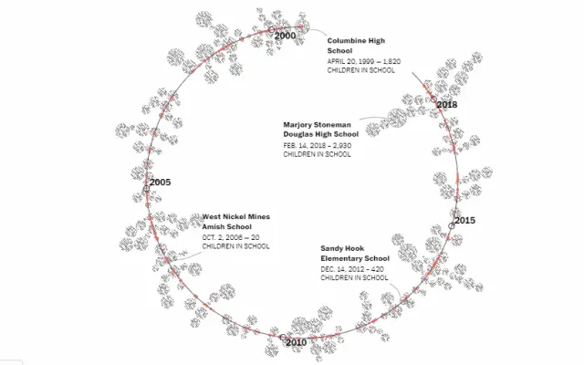
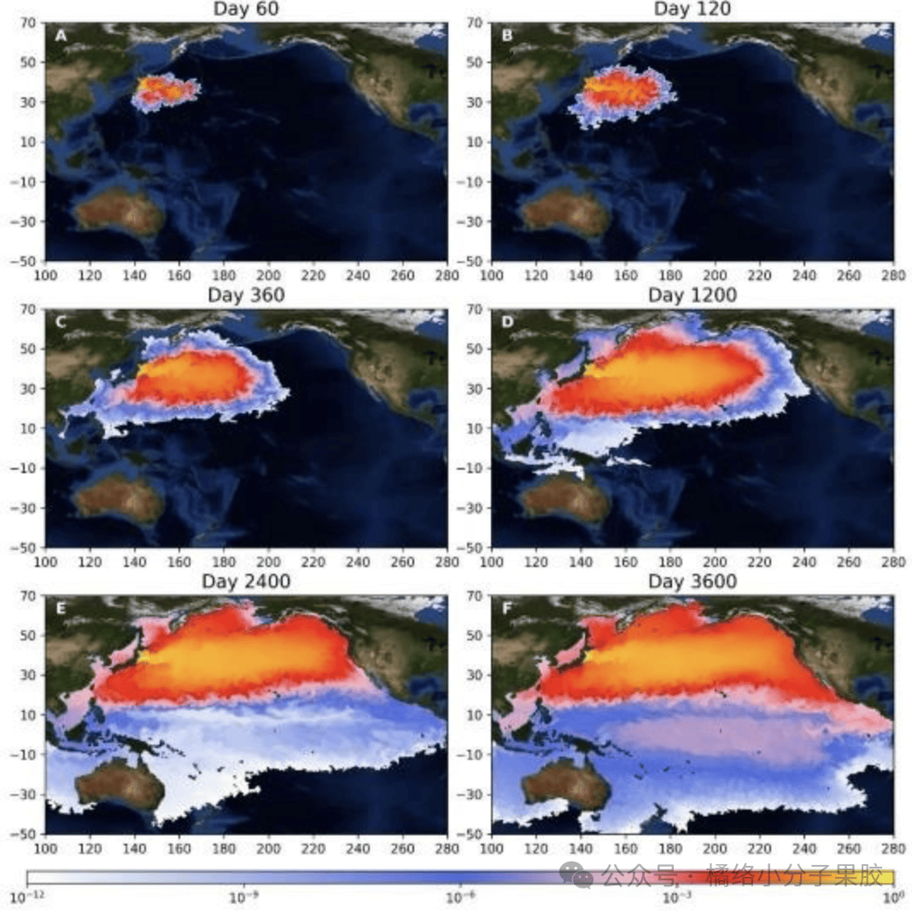
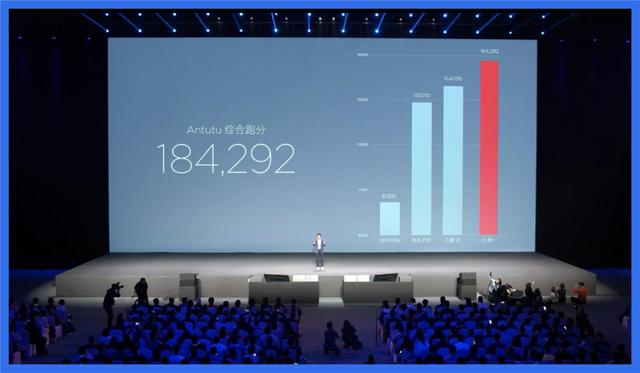
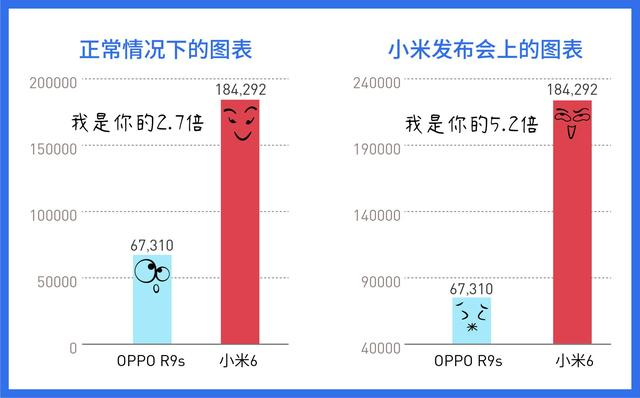

# 大数据可视化基础

## Task2：可视化作品评价——最好的和最坏的

### 专业：信息安全 学号：2111408 姓名：周钰宸

我认为好的可视化作品应该具备以下特点：

1. **准确性**：数据可视化应该忠实地反映数据中包含的信息，不歪曲、不误导、不遗漏

2. **有效性**：信息传达有重点，克制不冗余，避免信息过载，用最适量的数据-油墨比（Data-ink Ratio）表达对用户最有用的信息。

3. **清晰性**：表现方式清楚易读，具条理性，可以帮助用户快速达成目标，在最少的时间内获取更多的信息。

4. **美观性**：对数据的完美表达，合理利用视觉元素进行艺术创作，不过度修饰，给用户优雅的体验。

### 优秀的可视化作品：

例如，“学校枪击案”这个作品，华盛顿邮报统计了从2000年开始，校园枪击案的数量，每一个点代表10名遭受枪击案威胁的孩子。这个作品通过简洁、直观的图表，将大量的信息汇聚在一张图表中，让人一目了然，有效地传达了复杂的观点。

同时我心目中比较令我印象深刻的是日本核废水排放后，**清华大学做的模拟图**，就是利用数据模拟预测核废水接下来会污染中国边境海洋的过程。好的原因：真实，振聋发聩令人警醒，有很强的现实意义，直观，老百姓都能看得懂。

### 差的可视化作品：

然而，坏的可视化作品往往违反了上述原则。例如，有些作品的分类数据过多，导致图表难以阅读和理解。另一些作品的标签重叠，使得信息难以获取。还有一些作品的配色不合理，使得图表难以阅读。

小米发布会这是 2017 年 4 月 19 日小米发布会上的一幕，展示的是 小米6 手机和友商的三台手机在安兔兔上的跑分。发布会的 PPT 在这里耍了一个小聪明，坐标轴并非从 0分 开始，而是直接从 40000分 开始。这么做会从视觉上产生什么样的效果呢？**那就是夸大差距。**

数据上，小米6 的跑分是 18 万多分，而 OPPO R9s 是 7 万分不到，前者是后者的 3 倍不到。而从4万分开始展示，高度给人的视觉感受是双方的倍数有 5 倍多。

### 防止被忽悠：

为了防止“忽悠”，我们在创建可视化作品时，应该遵循以下原则：

1. **选择合适的图表类型**：根据要展示的数据类型和目标，选择最合适的图表类型。
2. **简化设计**：避免使用过多的颜色、字体和图形，使设计尽可能简洁。
3. **使用恰当的比例**：确保图表的比例准确，避免误导观众。
4. **提供清晰的标签和说明**：确保观众能够理解图表中的数据和信息。

我个人认为还是要看到原始的数据，要培养自身对数据的理解能力，而不是仅通过将数据可视化直观的效果，因为这个可视化的过程需要人来操纵，就可能存在猫腻，存在忽悠。

另外我找到一篇好文在这里分享：https://baijiahao.baidu.com/s?id=1694295595733136383&wfr=spider&for=pc

​              