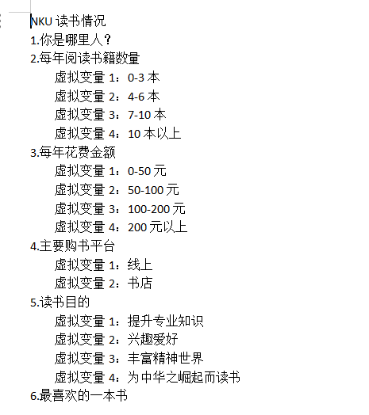

# 大数据可视化基础

## Task4：数据可视化大屏

### 第五组

>成员：
>
>2111408 网络空间安全学院 周钰宸 
>
>2111698 网络空间安全学院 于泽林 
>
>2111334 人工智能学院 刘宗桓 
>
>2111325 金融学院 韩啸宇 
>
>2112920 金融学院 肖一正

### 任务要求

请上传你的数字化大屏，说明你阐述的数据问题

### 任务准备

**==本次我们任务的主题是当代年轻人阅读情况统计==**

#### 数据收集

我们首先通过问卷星的方式，由两位金融学院的同学，设计并在校内收集了**100名在校南开学生的阅读书籍情况**。统计结果如下：


相关问题如下：



然后为了方便进行可视化处理，**我们需要将上述问卷星调查结果中的一些文本类型的数据转换为数值类型。通过Python代码处理后结果如下：**
																	 


#### 图片处理


为了能够让我们的可视化大屏效果更加好，我们在网上找到了一个图书的图片，并通过如下代码进行了透明度的处理：

```Python
from PIL import Image

# Load the image
img_path = "data/Book.webp"
img = Image.open(img_path)

# Convert the image to RGBA if it's not already in that mode
img = img.convert("RGBA")

# Retrieve the data of the image
datas = img.getdata()

# Create a new data list with modified alpha values
new_data = []
for item in datas:
    # Change the alpha value (reduce opacity to 50%)
    new_data.append(item[:-1] + (int(item[-1] * 0.5),))

# Update the image data with the new reduced opacity data
img.putdata(new_data)

# Save the modified image with reduced opacity
new_img_path = "data/Book_reduced_opacity.webp"
img.save(new_img_path)
```

**处理效果如下：**


### 任务过程

接下来我们利用数据依次制作每张子图：


**使用自由块组成可视化大屏：**


**选择可视化模板美化效果：**


**利用制作好的背景图片：**


**选择模板添加标题栏，最终呈现效果如下：**


### 任务结果展示


从上图结果中可以看出：

1. **最喜欢的作者：**日本著名推理小说家东野圭吾大获全胜，另外还有著名科幻小说刘慈欣等。
2. **最喜欢的购书平台：**可以看到当当和京东占据大头，亚马逊和天猫占较小部分。
3. **最喜欢的书籍：**几乎都平行占据位置，其中白夜行等可以和作者相互联系起来。
4. **每年买书的花销：**可以看到在当当网中大家购买的花销是最大的，另外花销也和购书平台喜爱度呈现正相关和累计效果。
5. **居住城市：**我们本次调研的南开学生在南方的居多，也是因为我们组员大部分来自北方，想要多了解下南方的同学读书情况。

**我们的可视化大屏链接为**：https://e.idataviz.com/src/q.html?s=nankai-e3a60cd632ed28c4

**二维码为：**
																					

### 任务感受

本次任务我们五个人通过小组合作，各发挥所长，完成了本次任务。我们收获颇丰，具体而言：

1. 通过分工安排，各取所长，我们收获了效率和沟通交流的合作能力，这对我们未来学习和工作都很重要。
2. 通过亲自制作问卷星并收集数据，我们锻炼了解决实际问题的能力。
3. 通过使用Dataviz进行可视化，我们了解了该可视化工具的强大和食用。

感谢老师审阅！
