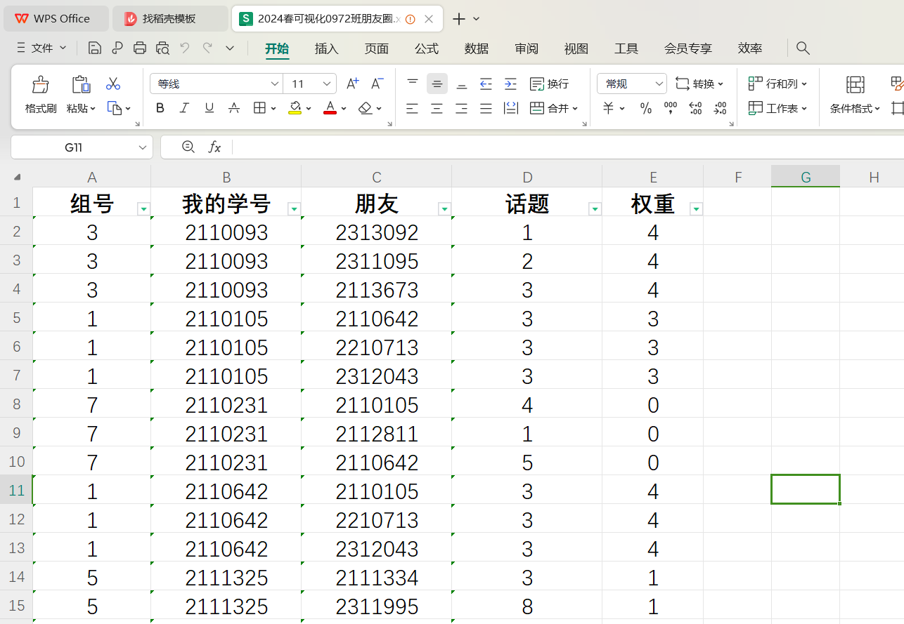
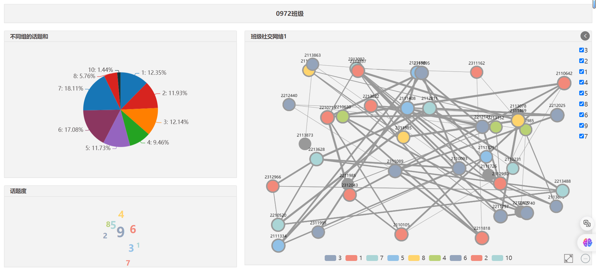

# 大数据可视化基础

## Task5：Dataviz与班级社交网络

### 专业：信息安全 学号：2111408 姓名：周钰宸

### 任务要求

*完成今天课上的Dataviz可视化图表制作，分析班级社交网络*

*有余力的同学，还可以研究下如何实现其他Dataviz图表，并将这些图表整合成一个数据可视化大屏。*

*提交文件有两个：*

1. *作品图片*
2. *作品二维码*

### 任务准备

首先在任务开始前，**通过老师上课使用问卷星统计的结果，将其处理为Excel文档，结果如下：**

分为以下几项：

* 组号
* 我的学号
* 朋友
* 话题
* 权重

将其作为数据导入DataViz就可以开始任务了

### 任务过程

本次任务过程**依次制作了三张可视化Dataviz图，并最终制作了一个可视化大屏展示。**具体过程如下。

#### 不同组话题饼状图

第一张图**我想要呈现不同的组对话题的重视度**，相对于开展话题多的（数量多），开展话题题号靠后的组（单个话题比重大），会占据较大的比重。

（不过由于话题题目相差较大，该图并不能很好地体现不同组的参与积极度，有待优化和调整）

1. **数据值：**话题（求和）

2. **图例：**组号

#### 话题词云图

第二张图我想要制作一个**最多被选择的话题的词云图**，通过话题进行求和。相对于被选择多的话题会重点展示。

1. **内容：**话题

2. **数据值：**话题（求和）

**从词云结果可以看到，话题9相对于最多，话题1，8等均较少。**

#### 班级社交网络图

第三张图也是最重要的图，**我想要制作一个班级社交网络图，能够将不同组别用不同颜色分开，不同组别之间话题权重通过线进行连接。**我通过如下分配，将表中数据分配给以下数据类型：

1. **源节点ID：**我的学号

2. **源节点名称：**我的学号

3. **目标节点ID：**朋友

4. **目标节点名称：**朋友

5. **关联强度：**权重

6. **关联方式：**话题

可以看到社交网络图可以通过右上角的选择，将**部分话题的相连关系**呈现。

可以看到通过最下面的图例，可以将**同组内的点集中展示**。或者**挑选只察看部分组之间的关系**。

最终我将**不同组按照颜色分开，为了减少混乱更加清晰**，呈现结果如下：

#### 可视化大屏展示

最后我将制作可视化大屏，通过选择了一个**三张图的模板制作**。并添加了相对应的**标题和颜色**等。

### 任务结果展示

**==最终我的作品结果如下：==**

我的作品链接为：https://e.idataviz.com/src/q.html?s=nankai-ebbca949768a3b7a

我的作品二维码为：
																			

### 任务感想与收获

本次任务，上课在老师的引导下，我和不同年级，来自不同专业的同学们通过多样的话题相识。下课后又亲身体验了Dataviz平台，将多种不同类型的数据，选择了符合的图进行制作，完成了本次任务。我收获了Dataviz可视化制作和分析能力之后，还结交了朋友，可以说是令我印象深刻。

感谢老师审阅！