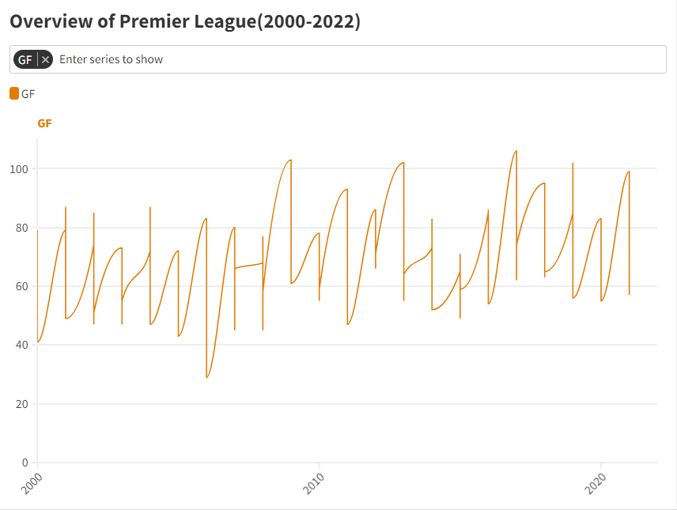

# 大数据可视化基础

## Task6：讲述你的Flourish可视化故事

### 专业：信息安全 学号：2111408 姓名：周钰宸

### 任务要求

*请完成一个Flourish可视化制作，可以是单独的一个可视化，也可以是一个故事集*

1. *请上传你的Flourish作品网址和几张截图*
2. *请对你的作品立意和数据洞见制作简单的文字说明*

### 任务准备

#### 2.1 数据收集

对于Flourish工具，我早就有所耳闻其作为可视化工具能力之强。**我想正好利用本此任务，完成一个有趣的可视化故事作品。**

本此我的可视化故事主题是：**英格兰足球超级联赛(Premier League)**

>英格兰足球超级联赛（Premier League，简称“英超”）是[英格兰足球总会](https://baike.baidu.com/item/英格兰足球总会/4823197?fromModule=lemma_inlink)属下的最高等级职业足球联赛，前身是英格兰甲组联赛。 [1-2]英超是“[欧洲足球五大联赛](https://baike.baidu.com/item/欧洲足球五大联赛/9856716?fromModule=lemma_inlink)”之一，由20支球队组成，由超级联盟负责具体运作，赛季结束后积分榜末三位降入[英格兰足球冠军联赛](https://baike.baidu.com/item/英格兰足球冠军联赛/7097321?fromModule=lemma_inlink)。
>
>英超联赛一直以来被认为是世界上最好的联赛之一，节奏快、竞争激烈、强队众多，是全世界商业运作最成功的联赛与收入最高的足球联赛。

我首先在**Kaggle**这个著名的数据挖掘平台上，找到了一组心仪的数据，其中记录了**2000-2022这22年间23个赛季的英超各个球队的积分榜，包括以下数据：**

| Season                      | Football season year                                         |
| --------------------------- | ------------------------------------------------------------ |
| Pos                         | Final position of the team for that season                   |
| Team                        | Name of the team                                             |
| Pld                         | Number of games played                                       |
| W                           | Win                                                          |
| D                           | Draw                                                         |
| L                           | Loss                                                         |
| GF                          | Goals Scored                                                 |
| GA                          | Goals Conceded                                               |
| GD                          | Goal Difference                                              |
| Pts                         | Total Points scored by the team in that season               |
| Qualification or relegation | Whether the team has qualified for the european continental cup or has been relegated to a lower tier league |


*数据来源：https://www.kaggle.com/datasets/quadeer15sh/premier-league-standings-11-seasons-20102021/data*

#### 2.2 数据预处理

在这之后，为了能够更好地将数据进行规范化的可视化，我需要首先对数据的格式进行一些处理。具体而言：

1. **年份：**由于真实足球赛季是2021-2022这种跨年的赛季。为了能够更好的统计，经第一列`Season`只保留2020这样的年份，不要“-”后面的具体跨年后的年份。

   Python代码如下：

   ```python
   import pandas as pd
   
   # Load the CSV file
   file_path = 'data/EPL Standings 2000-2022.csv'
   data = pd.read_csv(file_path)
   
   # Modify the 'Season' column to keep only the year before the hyphen
   data['Season'] = data['Season'].apply(lambda x: x.split('-')[0])
   
   # Show the first few rows to confirm the change
   data.head()
   
   ```

2. **Big6：**由于我想要提取出的数据并不包含全部球队，而只要包含英超最著名的六大传统球队。因此我需要将`Team`一列针对性地提取。

   Python代码为：

   ```Python
   # Load the original CSV file again
   data_original = pd.read_csv(file_path)
   
   # Filter the data to keep only the specified teams
   filtered_teams = ["Manchester United", "Arsenal", "Liverpool", "Chelsea", "Manchester City", "Tottenham Hotspur"]
   filtered_data_teams = data_original[data_original['Team'].isin(filtered_teams)]
   
   # Show the first few rows to confirm the change
   filtered_data_teams.head()
   ```

3. **排名：**我的可视化故事中，还包含每年的排名第一的球队信息，因此我需要通过`Pos`一列将排名第一的球队信息提取出来。

   Python代码为：

   ```python
   # Extract the information where 'Pos' (Position) is 1 for each year
   champions_data = data[data['Pos'] == 1]
   
   # Show the extracted data
   champions_data
   
   ```

4. **球队编号：由于后期进行可视化时候我发现Flourish中的一些对数据的特征要求，是得我需要将一些字符类型的数据转为数值型。**具体而言，我需要将Big6的球队按照字典的形式进行编号，并重新记录。

   代码如下：

   ```python
   # Load the provided CSV file
   file_path_big6 = 'data/Big6.csv'
   data_big6 = pd.read_csv(file_path_big6)
   
   # Dictionary to map the teams to numbers
   team_to_number = {
       "Manchester United": 1,
       "Arsenal": 2,
       "Liverpool": 3,
       "Chelsea": 4,
       "Manchester City": 5,
       "Tottenham Hotspur": 6
   }
   
   # Map the 'Team' column to the corresponding number
   data_big6['Team'] = data_big6['Team'].map(team_to_number)
   
   # Save the modified data to a new CSV file
   modified_file_path = '/mnt/data/Big6_Modified.csv'
   data_big6.to_csv(modified_file_path, index=False)
   
   # Show the first few rows to confirm the changes
   data_big6.head(), modified_file_path
   
   ```

5. **背景图片处理：**这里是为了给我的可视化作品添加一些好看的背景图片。但为了不对其它更重要的统计规律进行遮挡，首先需要对图片的透明度，颜色大小等进行一些处理。

   Python代码为：

   ```python
   # Load the provided CSV file
   file_path_big6 = 'data/Big6.csv'
   data_big6 = pd.read_csv(file_path_big6)
   
   # Dictionary to map the teams to numbers
   team_to_number = {
       "Manchester United": 1,
       "Arsenal": 2,
       "Liverpool": 3,
       "Chelsea": 4,
       "Manchester City": 5,
       "Tottenham Hotspur": 6
   }
   
   # Map the 'Team' column to the corresponding number
   data_big6['Team'] = data_big6['Team'].map(team_to_number)
   
   # Save the modified data to a new CSV file
   modified_file_path = '/mnt/data/Big6_Modified.csv'
   data_big6.to_csv(modified_file_path, index=False)
   
   # Show the first few rows to confirm the changes
   data_big6.head(), modified_file_path
   
   ```


**在完成了上述任务预处理后，我一共得到了四份数据，后面就开始正式任务啦。**

~~Flourish，启动！~~

### 任务过程

#### 3.1 Overview

第一部分是**对球队数据的总览**，这里由于取值分组依据的类型必须是123的数值类型，为了能够将`Team`进行分组画图，因此才有了上面预处理的球队编号操作的必要性。


在添加了一些文字，符号，更换了一些好看的颜色，添加了一些选择功能后，**整体呈现的内容和具体解读如下：**


* **Pos：**从2000-2022的23个赛季Big6球队最后一名的排名。

  可以明显看到在2000-2010年间波动是较大的，当时主要由于曼城和热刺两个Big6球队战绩非常不好，甚至还没有挤进现在我们所说的Big6的行列，当时它们的成绩导致了最低排名甚至达到了18。

  另外也说明在2000-2010年间等早年间一些平民球队如莱斯特城等蓝狐奇迹的出现比较频繁，平民球队仍然具有和强队竞争的能力。不过随着资本介入，曼城等大球队的~~石油爹~~大老板们入股，小球队的经济实力逐渐落后，成绩上也一落千丈，**蓝狐奇迹，恐再难发生。**

  能够明显看到在2010-2020年间Big6最终的最低排名多次就是第6，代表着逐渐垄断了前6的行列。代表着Big6的崛起，现代金元足球的崛起。

  

* **Team：**从2000-2022的23个赛季的球队成绩变化，在Big6球队中的位置。

  Big6球队的编号为：

  ```python
  "Manchester United": 1,
  "Arsenal": 2,
  "Liverpool": 3,
  "Chelsea": 4,
  "Manchester City": 5,
  "Tottenham Hotspur": 6
  ```
  

* **Pld：**从2000-2022的23个赛季的英超联赛比赛轮数量，可以看到一直是单赛季38轮比赛，这一点从未变化。

  

* **W：**从2000-2022的23个赛季的Big6球队赢球场数范围。比如2021年是最低16，最高29，代表着Big6赢球场数介于之间。

  能够发现随着时间的推移，Big6的球队每个赛季表现最好的球队和最差的球队之间的表现极差相较早年在缩减，在2010年左右极差达到最小，近些年极差又有回升趋势。

  这不仅很好地体现了**Big6在21世纪的崛起，其在2010年左右达到了最势均力敌的状态**，并且近些年比如曼联热刺的一些个别球队成绩的下降，又进一步代表了成绩的差异。

  

* **D：**从2000-2022的23个赛季的Big6球队平局场数范围。

  平局场数极差呈现先减小再增大，同样体现了Big6在21世纪的崛起，其在2010年左右达到了最势均力敌的状态，而差距在近几年再次扩大。

  

* **L：**从2000-2022的23个赛季的Big6球队输球场数范围。

  这张图对Big6崛起的体现再好不过了，早年间2000年初极差变化范围极大，甚至最多出现了超越20的赛季输球场数。不过近年来明显较小，同样也是在2010年左右极差达到最下。

  **这些无一意外地体现了Big6球队在21世纪面对平民球队成绩越来越稳定并且越来越好。**彼此之间强强对话成绩不算在其中，因为Big6强强对话一方输另一方赢，都会被记录其中。

  

* **GF：**从2000-2022的23个赛季的Big6进球数。

  

* **GA：**从2000-2022的23个赛季的Big失球数。

  

* **GD：**从2000-2022的23个赛季的Big6净胜球数。

  

* **Pts：**从2000-2022的23个赛季Big6的赛季末积分范围。可以以看到也是极差在变化，在2010-2015年左右达到较小，近年再次扩大。

  


#### 3.2 Goals Statics

这次挑选了**从2000-2022的23个赛季每年的冠军球队的进球数，失球数和净胜球数。**

我为图片添加了相对应的背景图片（背景图片就是英超官方Logo），颜色，表图，还标出了一个特殊的年份等。


**最终呈现效果如下：**


从上面的图片能够看到许多隐藏的事实：

* 可以注意到这些冠军球队的丢球数一直保持有一个较低的水平，证明了冠军球队中防守的重要性。

* 可以注意到随着时间的推移，这些冠军球队的进球数逐渐增大，相比于2000年的80球左右，2020年普遍来到了100球左右。**这其实代表了足球的一个隐形发展趋势：防守艺术的消失。**

  随着防守规则的种种改变，防守强度的变化，现在足球战术体系的革新，大开大合的场面越来越多，进球在变得容易，防守在变得越来越困难。

  仔细思考，这背后也有资本的原因。由于足球比赛一直以来被一些其它体育行业诟病的一点就是进球少观赏度低。相比于快节奏的篮球等，足球更适合真正热爱足球，欣赏足球战术的人来观赏。

  但是为了提高收视率，提高场均进球数，拉低足球观赛门槛的趋势在逐渐形成。甚至阿森纳的传奇主教练温格，曾经提议足球越位规则改为超出一整个人，这一规则已经在很多低级别联赛施行，**但这一点我个人十分不同意。**

  过于的追求观赏性，只会进一步提高防守球员的防守难度，造越位战术和防守艺术也将成为过去式。这样只会导致足球越来越快节奏，进球越来越多，尽管观赏性上去了，但是却丢失了足球本身的东西。

  **因此我提议还足球一片净土，让资本远离足球。足球发展应当不忘初心，保持这项运动的本质和纯真。**

#### 3.3 Big6

这次挑选了**从2000-2022的23个赛季Big6球队的最终排名。**

我同样地用到了之前在预处理时候降低透明度的背景图片加入了其中，背景图片就是Big6球队的旗帜。

同样地我也调整了很多颜色，图标，显示等等。


**最终呈现效果如下：**


从上面的可视化图中能够发现很多有趣的现象：

* **Manchester United：**恕我直言，尽管英超近些年诸强云起，但是英超历史第一豪门还是红魔曼联。这是由于其深厚的历史底蕴和21世纪前15年间的优秀战绩的必要结果。

  可以看到在21世纪前15年间，曼联的成绩一致位于极高的位置，甚至在2006-2008年间完成了英超三连冠。之后直到2013年之前，曼联的位置从来没有跌落过前三。

  不过近些年来，随着曼联买人的失败，高层的腐烂等等原因，球队成绩一落千丈。从2013年起就远离了前3的位置，但相对来说也没有低于前8。最近两年由于一些欧冠战绩的回暖，包括逆转巴黎，还有球队迎来C罗的回归而有所好转，**不过在腾哈格接过曼联的教鞭后，曼联正式进入了“腾哈格时代”。**

  这可不是什么好词，“奥娜娜”，“一亿的圆规”，“藤甲军”，“赛后逆转”。曼联逐渐成为了新时代的流量之王，英超的笑柄。

  随着梅努，霍伊轮，加纳乔，麦克托米奈等小将的出现，**英超历史的第一豪门，红魔曼联，能否回到属于它的位置呢？**

  **让我们敬请期待......**

* **Arsenal：**枪手作为一支传统的北伦敦强队，曾经在2003-04赛季整个赛季创下了英超历史上跨赛季49场不败的神话。**那时的阿森纳在温格和亨利的带领下，踢着代表着团队足球的传切踢法，也从此有了“美丽足球”的美誉。**

  不过好景不长，球队也因为一些原因成绩出现了下滑，在2004-2013年稳定地在3-4名之间徘徊**，也是“阿森纳”和“4”这个数字之间神奇的渊源。年年争四**，保住欧冠席位，成了那些年成绩衰落后枪手球迷的最大的心愿。

  进入2010的新十年，甚至在2015年后，球队成绩更是一落千丈，甚至在2019-2020年两年间的第八名，也是刷新了球队的新低。

  但是，随着球队传奇阿尔特塔从瓜迪奥拉学成归来，萨卡，厄德高，特罗萨德，马丁内利，加布里埃尔，让枪手在2022年挂起了一股令所有人都难以想到的青春风暴。尽管在积分榜领先了大半个赛季后被曼城最终反超夺冠，但加上新赛季亿元先生赖斯的加盟，加上小将们越来越成熟的经验和心理，阿森纳令人值得期待。

  **枪手，那生锈已久的炮口，终于又冒出了闪耀的火星。**

* **Liverpool：**利物浦，安菲尔德，这座命运多舛的球队。和其它的英超球队不同，利物浦更加擅长的是欧洲赛场。

  和它的死敌曼联相比，利物浦前十多年尽管国内成绩一直不佳，**但是欧洲赛场中却屡创造传奇，红军利物浦，在欧洲赛场上仍让人闻风丧胆。**米兰，多特，巴萨，都成为了利物浦逆转的背景板。不过国内成绩不佳，一直以来都是球队的一大问题。

  但是，他们等来了，摇滚足球教父——克洛普。随着克洛普的加盟，红军依次从南安普顿引进了马内和当时的世一卫范戴克，还有萨拉赫，罗伯森和阿诺德的两翼齐飞。充满着血性，冲击，**利物浦恐怖的体力和高压逼抢战术，代表了现代足球的攻守转换的超快节奏，为红军带来了新的生命力。**使得利物浦不仅在欧洲赛场上时隔多年重新捧起欧冠冠军并且多次闯进决赛，国内赛事中也迎来了稳定的上升。

  一切都在向好的地方发展，直到克洛普宣布离任。

  **红军教父的离开，利物浦，又该何去何从？**

* **Chelsea：**蓝军切尔西，铁血蓝军。切尔西作为伦敦传统豪门，在早年间因为斯坦福桥坐落在富人区，曾经因为球迷不够热情而被戏称为“伦敦图书馆”。

  不过一个人的到来，改变了一切。"The Special ONE"——狂人穆里尼奥。随着穆里尼奥的加盟，切尔西逐渐打起了一股实用主义的风采，球队以钢铁的防守著称。**甚至切尔西在04-05赛季由穆里尼奥率领下以赛季仅失球15个夺得冠军。高效且实用的防守反击，让蓝军切尔西势不可挡。**不论是国内赛场上在前10年间的稳定战绩，还是欧冠上的驰骋沙场，穆里尼奥和切尔西都在彼此证明着自己。切尔西老兵们也最终如愿在安联球场如愿夺得了队史第一座大耳朵杯。

  同样好景不长，切尔西可以说是除了热刺和曼城以外，四大传统豪门中成绩最动荡的，从图也可以明显看到球队在2015年甚至跌倒了第10名。切尔西频繁换帅，大资本家的介入，球员一代又一代的变化着，也没法带来了战绩上的回升......

  **蓝军崛起之路，或许还有很长。**

* **Tottenham Hotspur：**热刺，是Big6中最受人争议的一位，甚至很多人说要用莱斯特城代替热刺。热刺与“冠军”这两个字，似乎一直无缘。

  从图中的数据也能看到，热刺的成绩在2000年左右非常差，和另外的四支球队完全没法相提并论，也就比从英冠升上来的曼城好一点。尽管球队成绩在近十年间已经逐渐在上升，但是依然不稳定。频繁地换帅期间，还屡次爆出内讧等更加严重的内幕，包括孔蒂怒喷，孙兴民和洛里更衣室吵架等。

  但热刺从有那么一些闪耀点，让人又有时候不经夸赞。多年来一直坚守的热刺和英格兰双料队长哈里凯恩，亚洲一哥孙兴民，初出茅庐的贝尔，莫德里奇，欧冠惊奇逆转阿贾克斯晋级决赛。热刺仿佛就是这样，平凡而又不屈不挠。

  随着波斯特科格鲁的加盟和麦迪逊的爆发，热刺在凯恩离队后甚至打出了令许多人刮目相看的攻势足球。

  如果球队势头能够保持下去，或许球队的队史第一座冠军，也将不再是奢望。

* **Manchester City：**曼城，**金元足球最成功的代表之一。**从球队的战绩可以看到，早年的曼城可以说是和豪门完全沾不上边。动荡的成绩，低迷的排名，曾经的曼彻斯特的两家球队，没有人想过曼城有朝一日能够崛起。

  但是，

  在英超官方举办的英超30年最佳改变比赛表现评选中，阿圭罗9320绝杀QPR当选。

  2011-12赛季英超末轮，曼城对阵QPR，曼联对阵桑德兰，率先结束比赛的曼联取胜后领先曼城3分，曼城90分钟时仍以1-2落后。第92分钟，哲科为曼城扳平比分，**第93分钟20秒，巴洛特利助攻阿圭罗完成绝杀，曼城最终以净胜球优势奇迹般力压同城死敌曼联获得当赛季英超冠军。**

  或许就是从那一刻开始，曼城的崛起之路就开始了，随着资本家大股东的介入，球队终于有了和豪门相提并论的经济实力。在引入了现代足球教父瓜迪奥拉后，球队更是大手笔引援，为瓜迪奥拉这个完美主义者搭建了最好的平台。

  随着瓜迪奥拉的球队战术和体系逐渐形成，曼城迎来了英超前无古人的五年四冠，无疑奠定了豪门基础。这很多程度上归功于瓜迪奥拉打造的完美体系，和同样是土豪球队的巴黎相比，曼城的钱明显都花在了刀刃上，有钱也有脑，这你怎么玩~

  尽管欧洲赛场曼城一直不顺利，但就在2022-2023赛季曼城在引进了哈兰德后终于捧起了队史第一座欧冠冠军，也在同年完成了五冠王的伟业。成为了英超历史上第二支三冠王球队。

  **我们见证了一支欧洲豪门的诞生。**

  **二十年前接受采访的弗格森爵士怎么也不会想到，如今他口中“吵闹的邻居”，却一跃而上，占领了曼彻斯特甚至整个欧洲的天空。**

  **蓝月当空，曼城的传奇故事，还会持续很多很多年......**

#### 3.4 My Story

最终我将上述四个可视化作品拼接在一起，**完成了我的Flourish可视化故事，主题就是英超的二十年。**

期间我还对Overview图中球队编号等加上了一些注释，和一些其它可视化图片的介绍。进行了更好的完善。


**最终我的可视化作品：Premier League——Best League In the World**

**==整体效果如下：==**


**==总体来说，任务完成地相当成功！==**

### 任务总结与收获

#### 4.1 作品立意

本次作品就是为了呈现**英超二十年的辉煌和跌宕起伏，以直观的方式感受欧洲顶级联赛的精彩。**

#### 4.2 数据洞见

上述任务中，我不仅完成了可视化任务，更重要的是我对每一个可视化作品的细节，都根据历史事实，对其进行了分析。

**发现了历史足球的发展趋势，英超各大豪门的兴衰史等，可以说数据洞见十分成功。**

#### 4.3 一些感想

本次可视化作品，我通过结合自己感兴趣的主题——欧洲足球，利用Flourish可视化工具，制作了英超二十年的可视化故事。

我不仅感受到Flourish可视化工具的强大，并且在这个过程中真正投入自己喜爱的东西后，对可视化分析陶醉其中，让我再一次感受到了数据可视化的美丽！

我的可视化作品网址为：https://public.flourish.studio/story/2316964/

感谢老师审阅！
