# 大数据可视化基础

## Task7：Tableau可视化作品

### 专业：信息安全 学号：2111408 姓名：周钰宸

### 任务要求

*发挥创意，用tableau制作可视化作品。例如：一份可视化动态建立如何？*

*请上传tableau源文件、作品截图、网页链接。*

### 任务准备

首先我为了能够进行可视化，首先自己编造了两张Excel数据表：

1. **个人经历表：**我畅想了一些我的未来哈哈哈。主要包括学术，专业和志愿者服务三项。**包含了经历类别，学习公司名称，角色，地点，开始日期，结束日期以及描述。**

   ~~其中研究生是我编的~~

   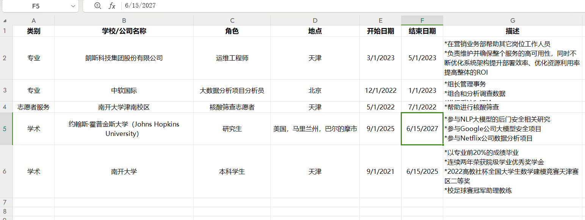

2. **个人技能表：**我根据自己的个人情况写了一些编程语言和工具（包括Tableau）的能力，以及个人的评级。

   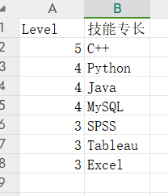

   然后就可以正式开始任务啦。

### 任务过程

首先我先创建了一个项目，输入了名称和一些描述。

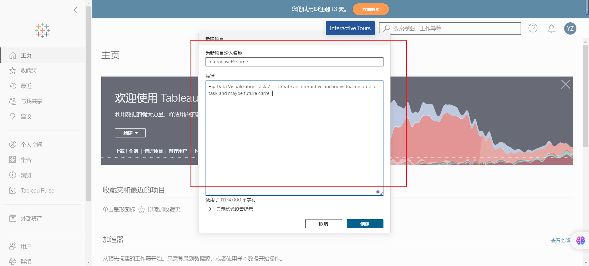

然后我为该项目创建了工作簿，项目名称就是**InteractiveResume即交互式简历。**

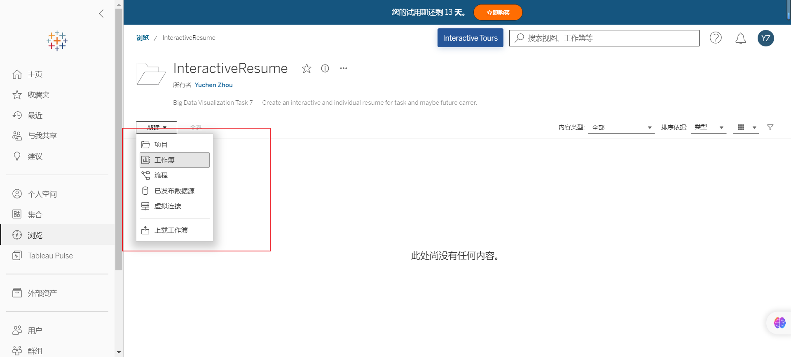

然后将我的**两组数据导入**，结果如下：

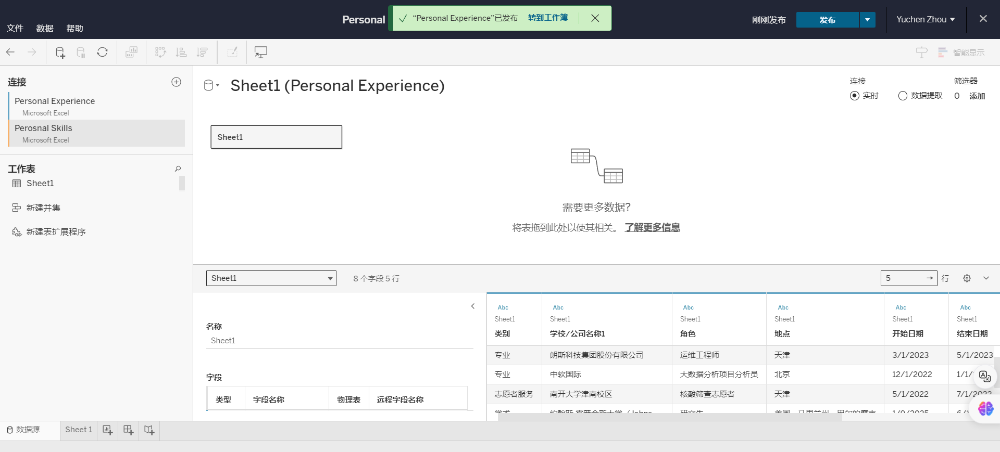

#### 绘制个人经历图

首先绘制个人经历图，先进行一些预操作，包括将**开始日期设置为“日期”类型。**

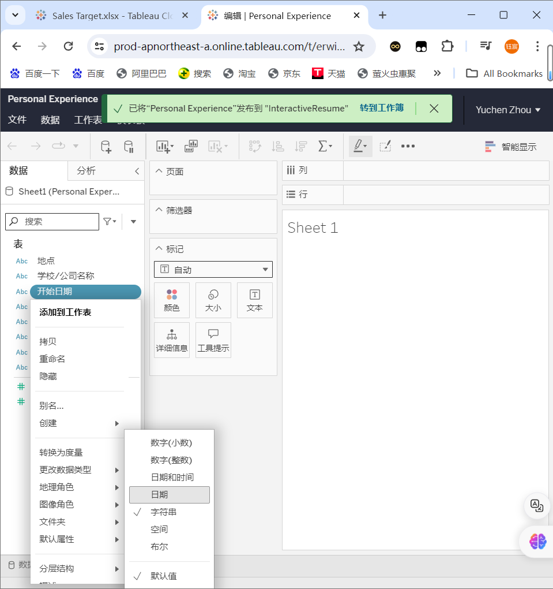

之后以开始**日期为列，公司名称为行**。并添加**自定义计算字段“持续时间”**。选择日期类型“DATEDIFF"。操作过程如下图所示：

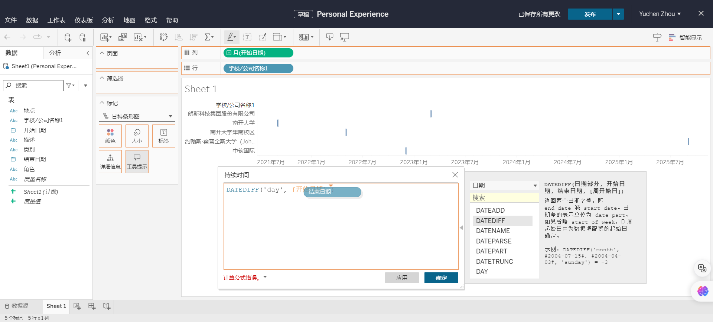

然后为不同的开始和结束时间定义颜色等，**设置详细信息**，使得可以点开后具有详细信息的描述，制作过程如下：

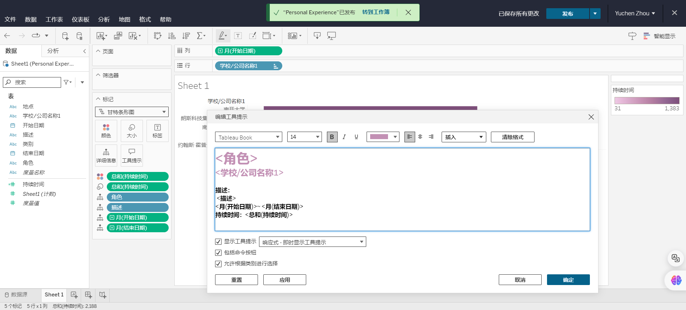

制作完成后**个人经历图，结果如下：**

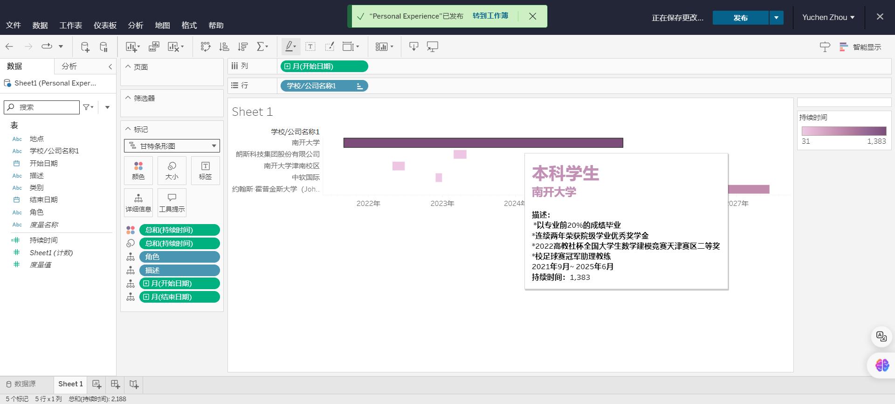

#### 绘制个人技能图

然后绘制**个人技能图**，这里比较简单，就不详细陈述，主要通过列为两个总和，分别作为横线和后面的圆点。行是技能专长。**制作结果如下图所示：**

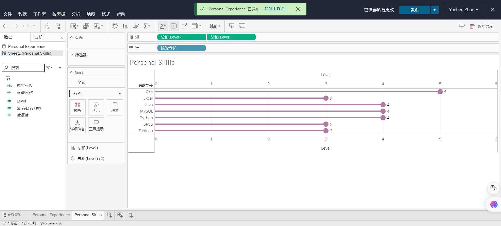

#### 制作仪表盘

然后将两张图放到仪表盘中，并调整合适位置。

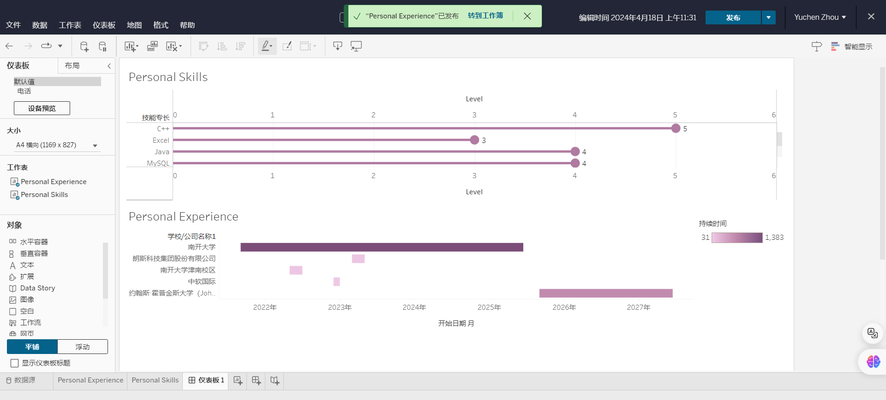

然后添加我的**个人信息和一个个人logo。**

~~实际上这里应该用自拍，但我不好意思。~~

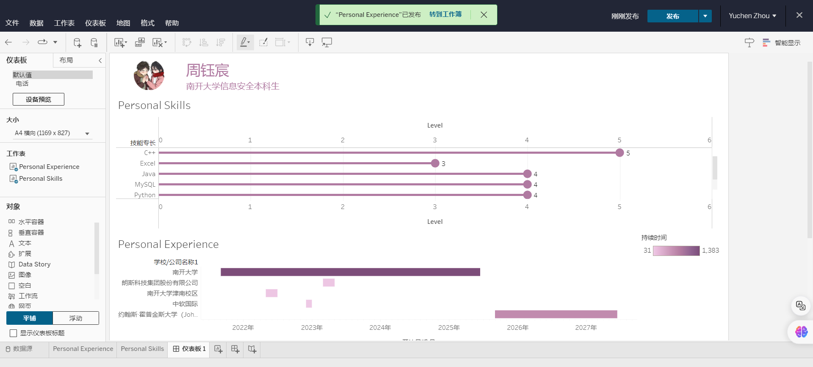

添加一个**个人简介**，和其它内容拼接在同一个仪表盘中：

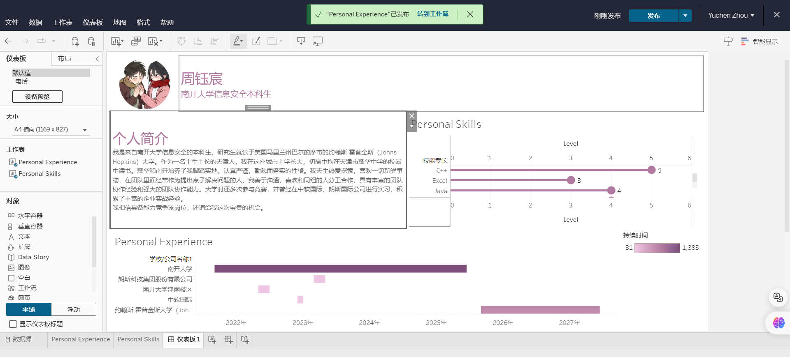

由于个人简洁陈述部分过于冗长，为了能够使得**不同的经历方便区分**，制作另一个工作簿。**展示经历类型，不同的经历用不同的颜色和图形：**

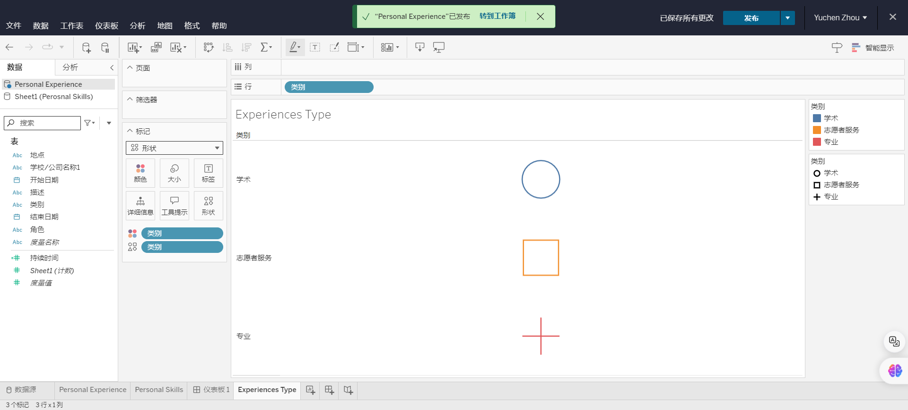

作为全部视图后，放入仪表盘：

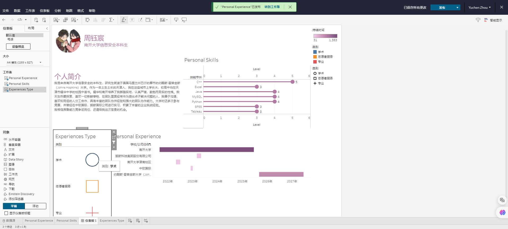

**选择经历类型边上的作为筛选器按钮，实现可以通过点击左边的不同形状查看不同类型的经历，以此实现更强的交互性。**

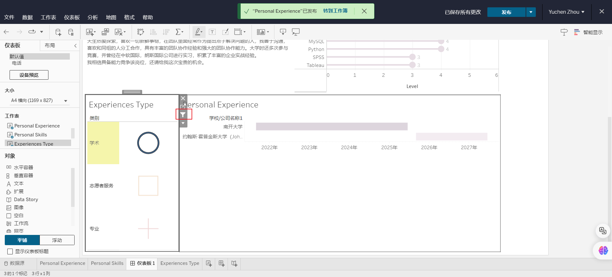

添加对**这部分的使用说明，让交互更加明确：**

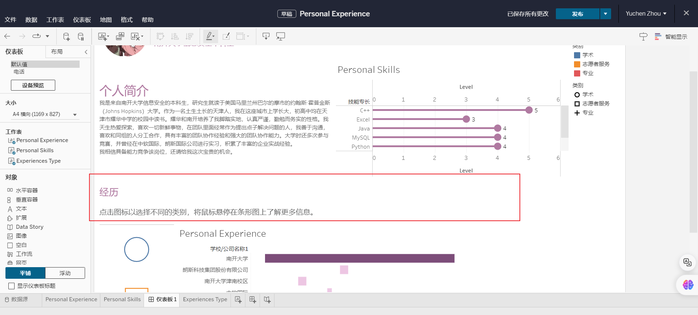

最终整理下格式，我的个人简历就制作完成啦。

#### 个人简历结果

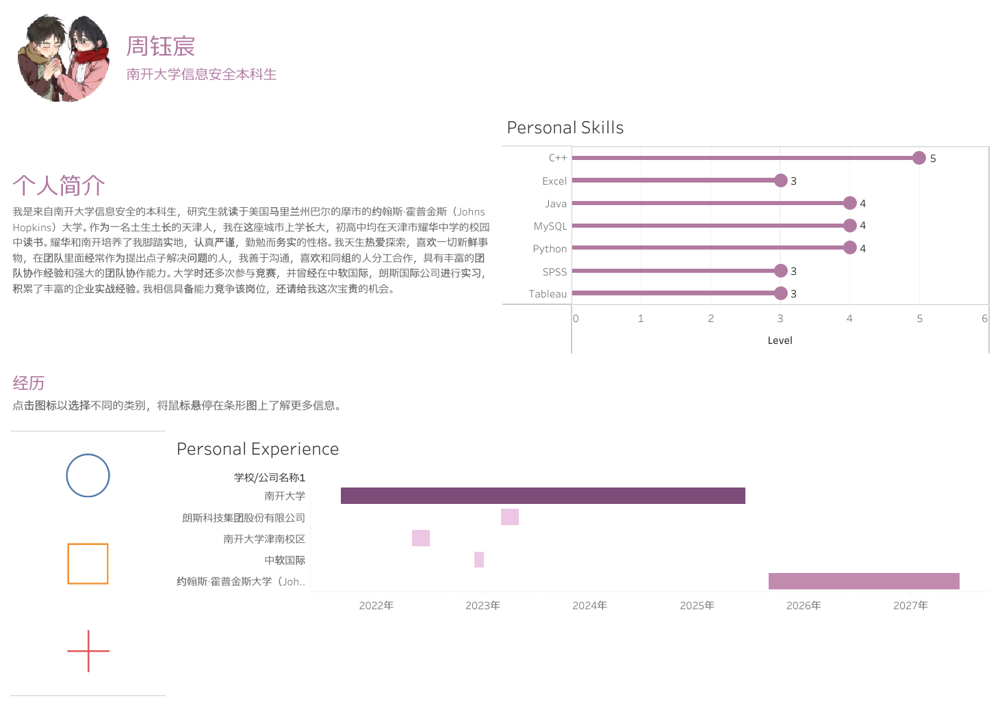

相关链接为：https://prod-apnortheast-a.online.tableau.com/t/erwinzhouae87aff18b/views/PersonalInteractiveResume/1

**==总体来说，任务完成地相当成功！==**

### 任务总结与收获

本次任务，通过认真学习老师提供的Tableau课件与平台，我感受到了该工具的强大。之前也从来没有自己制作过简历，制作过程中我多次考虑到交互性，通过设计筛选器等功能进行设计，更好地实现了多功能和便捷性。最终完成了一个满意的可视化交互性简历。总体来说我收获颇丰，**希望未来的学习工作中我可以进一步使用Tableau这个强大的可视化工具，做出更多优秀的作品！**

